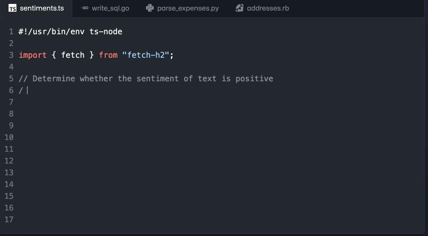

# Introduction to GitHub Copilot


Copilot overview

<div class="center-hubber">

 <span>@gitstua</span>
</div>

---
# Focus is learning about GitHub Copilot functionality

## We won't cover any of the following:
- GitHub Copilot pricing
- Any legal considerations

For these topics I will refer you to the Copolit FAQ avalable at [gh.io/copilotfaq](https://gh.io/copilotfaq)

---

## Basic
Compile it to try it


---

## Intellisense
Type and you get ideas from your code


---

## GitHub Copilot
AI synthesizes code from your code


---

## What is GitHub Copilot?

- AI-powered paired programming assistant
- Developed by GitHub and OpenAI
- Uses machine learning models to suggest code snippets

---

## How GitHub Copilot works

- Uses OpenAI Codex model
- Analyzes context and patterns in codebase
- Suggests relevant code snippets when you type

---

## Benefits of using GitHub Copilot

- Faster coding
- Improved accuracy
- Learning tool
- Less time writing the simple stuff

---

## Potential limitations of GitHub Copilot
We are constantly evaluating and improving Copilot including our vision of where you can improve the whole development cycle with our vision Copilot X.

- Limited language support
- Code quality process still required
- May not compile

<!-- It doesn't replace
- Your unit tests
- Your security tooling
- Your code review process
- Your code quality tooling
- Functional tests
-->

---
## Demo 1 - C#
<!-- ```
dotnet new console -o copilot
``` 
// obtain public ip address into variable
// obtain public ip address into variable using httpclient
// print public ip address
//get the current date and time
//print the current date and time
//get the current temperaturein london using httpclient from bbc weather
//print the current temperature in london
//make a list of zoo animals
//print 2 random animals from the list
//get a list of the azure ip addresses for azure 
//get a list of australin states short codes 
//print a random australian state
//print type of credit card based on number
//validate email address

-->

---
## Demo 2 Terraform
<!-- 
- get a quickstart from the web
- add some new stuff

 -->
---
## Demo 3 Python
- download an image from the web and save it to disk
- create a tumbnail


---
## Demo 4 Markdown
<!-- markdown presentation teaching the basics of azure -->

---
## Future of GitHub Copilot

- Expanding language support
- Improving performance
- Becoming an essential tool for developers
- More than just code suggestions, but a full development assistant

---

## Conclusion

- GitHub Copilot can save significant time and effort for developers
- It has some limitations that need to be considered
- As machine learning models improve, Copilot's usefulness will only increase
