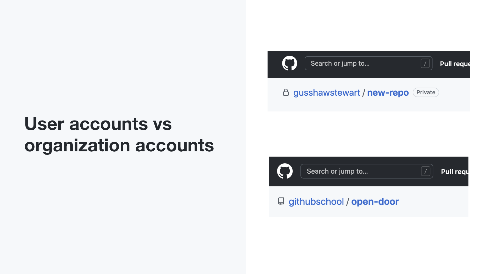
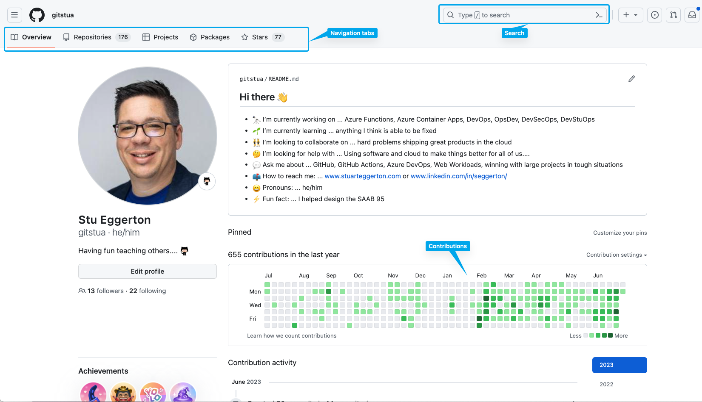
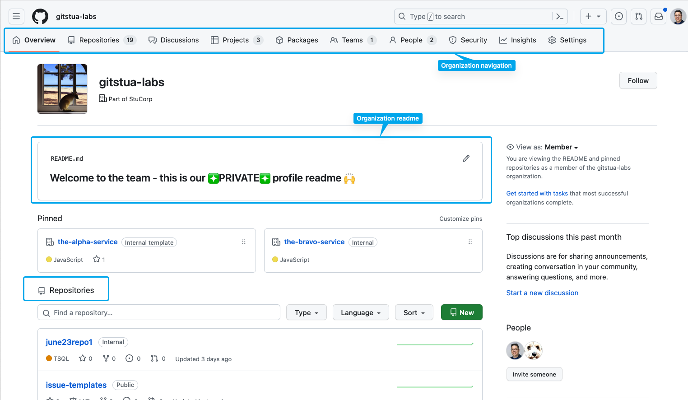
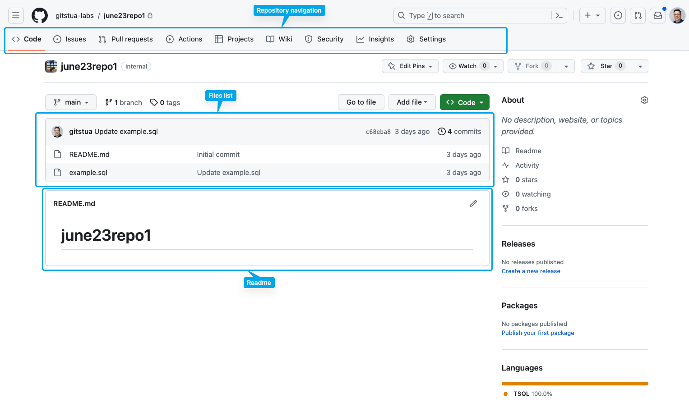
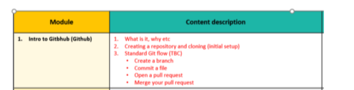

# DRAFT - not for use

---

# updated AGENDA - GitHub 101
- Why are we adopting a version control system?
- What is GitHub?
- Using the GitHub website
- Protecting secrets
- Making changes to your code
- Suggesting and merging changes
- Working with other tools and GitHub


<!-- 
- 5m - Why do we need source control?
- what is a distributed Version Control system
- 4m what is GitHub - video
- concepts around user vs organisation repos
- 5m overview of the UI for code (NOT FOR DATA)
- 10m demo of the UI
- 2m demo that secret scanning will block secrets (push protection)
- 3m demo fork to userspace
- 3m demonstration of editing a file in browser (quick)
- 5m demo of PR
- 5m demo of Desktop to clone a repo
- you can edit a file using whatever you like - terradata studio, vs code, any text editor
- others can use SSH, command line VS Code if they like

-->

---

# Introduction to GitHub


<div class="center-hubber">

 <span>@gitstua</span>
</div>

<!-- 
PREP
1. Create a new repo
2. Setup a few files

 -->

---
## Agenda

AGENDA - GitHub 101
1. Setara - Why do we need source control?
2. A lap around GitHub
3. How can I use GitHub?
4. Using git to commit code to repositories
5. Working as a team: Pull Requests and merging

<!--

3. How can I use GitHub?
 - GitHub Website
 code review etc

 - GitHub Desktop <<<
your copy of 

 - Command Line
advanced users 

-->

---


## How can I use GitHub?
 - GitHub Website
 - GitHub Desktop <<<
 - Command Line

---

## GitHub at CBA
<!-- - Plan your work with **issues** and **projects**  -->
- Securely store your code in **repositories**
- Collaborate with others using **pull requests**
<!-- - Build and deploy your code using **Actions** -->
- Advanced Security - protect from adding passwords
---

# Levels of GitHub
<!-- - Enterprise -->
- Organization
- Repository


---



---

## A lap around GitHub

---



---


---


---


---

## Demo 1


---

Pull request (including Draft PR)

Reviewing a PR


<!--
Innersource module will cover CODEOWNERS
-->


---

## What is zzz?

- example

---

## How zzz works


- Uses OpenAI Codex model
- Analyzes context and patterns in codebase
- Suggests relevant code snippets when you type

---

## Benefits of using aaa

- Faster coding
- Improved accuracy
- Learning tool
- Less time writing the simple stuff

---

## Potential limitations of GitHub Copilot
We are constantly evaluating and improving Copilot including our vision of where you can improve the whole development cycle with our vision Copilot X.

- Limited language support
- Code quality process still required
- May not compile

<!-- It doesn't replace
- Your unit tests
- Your security tooling
- Your code review process
- Your code quality tooling
- Functional tests
-->

---
## Copilot for Business
- Enterprise controls such as enforcing blocking suggestions matching public code		
- Proxy support
- Allocate licences to users

---
## GitHub Copilot Demo 1 
### C#


<!-- ```
dotnet new console -o copilot
``` 
// obtain public ip address into variable
// obtain public ip address into variable using httpclient
// print public ip address
//get the current date and time
//print the current date and time
//get the current temperaturein london using httpclient from bbc weather
//print the current temperature in london
//make a list of zoo animals
//print 2 random animals from the list
//get a list of the azure ip addresses for azure 
//get a list of australian states short codes 
//print a random australian state
//print type of credit card based on number
//validate email address

-->

---


## GitHub Copilot Demo 2 
### Terraform
<!-- 
_backgroundColor: lightgray
_color: black;
 -->

<!-- 
- get a quickstart from the web
- add some new stuff

 -->
---
## GitHub Copilot Demo 3 
### Python
<!-- 
_backgroundColor: white
_color: black;
 -->

<!-- 
- download an image from the web and save it to disk
- create a tumbnail 
- save the image as black and white
- save the image as sepia

-->


---
## GitHub Copilot Demo 4 
### Markdown
<!-- 
_backgroundColor: white
_color: black
 -->


<!-- markdown presentation teaching the basics of azure 

presentation about dogs

-->

---
## Future of GitHub Copilot

- More tuned language support
- Improving performance
- Becoming an essential tool for developers
- More than just code suggestions, but a full development assistant

---
## GitHub Copilot Demo GitHub Copilot X

This is the intent on where we are going in the next versions. We are figuring out how this will work and how to make it work for you. 

<!-- 
OPEN THE GITHUB COPILOT X Chat GPT Panel

1. create a terraform file
2. create a threejs example, create a house
3. highlight some code and explain
4. ask it to summarize with fewer words
5. create some unit tests
6. /debug

PR
DOCS - https://copilot4docs.githubnext.com/
Voice
CLI

https://github.com/features/preview/copilot-x

 -->
---

## Conclusion

- GitHub Copilot is your AI-paired programming assistant
- Designed specifically to help synthesise code
- GitHub Copilot for Business has enterprise controls

---
# Focus today was learning about GitHub Copilot functionality

## We didn't cover any of the following:
- GitHub Copilot pricing
- Any legal considerations

For these topics I will refer you to the Copolit FAQ avalable at [gh.io/copilotfaq](https://gh.io/copilotfaq)

