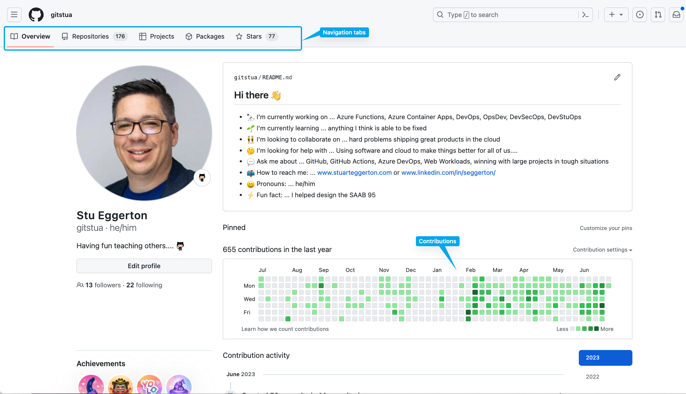

<!-- _footer: "" -->

# Example presentation 2023

   

  Stu Eggerton 
  Customer Success Architect

   

  Mona Lisa 
  Octocat

---

# AGENDA

- new list wrapping h1 h2 for nice layout
- another example showing how to use the columns div
- Demo - deploying ARC
- Runner groups

---

  # Example of new-list div wrapping h1 h2 

  ## testing123
  - world hello world hello world hello world hello world hello world hello world h
  - hello
  - world

  ## H2
  - a 
  - d
  - s

---

  

  # Example of columns div layout in the deck
  

  

  - bullet point 1
  - bullet point 2 is a really long one showing the wrapping
  - bullet point 3
  - bullet point 4
  - bullet point 5
  - bullet point 6

  

---

# Standard h1 title with some bullet points
<!-- 

 -->

- bullet 1
- bullet 2 is a really long one showing the wrapping of text over another line
- bullet 3
- bullet 4
- bullet 5

---

# standard h1
## standard h2
### standard h3

---
<!-- _footer: "" -->

# Resources
- some text here
- to the right is an example of an imagexs
- 
