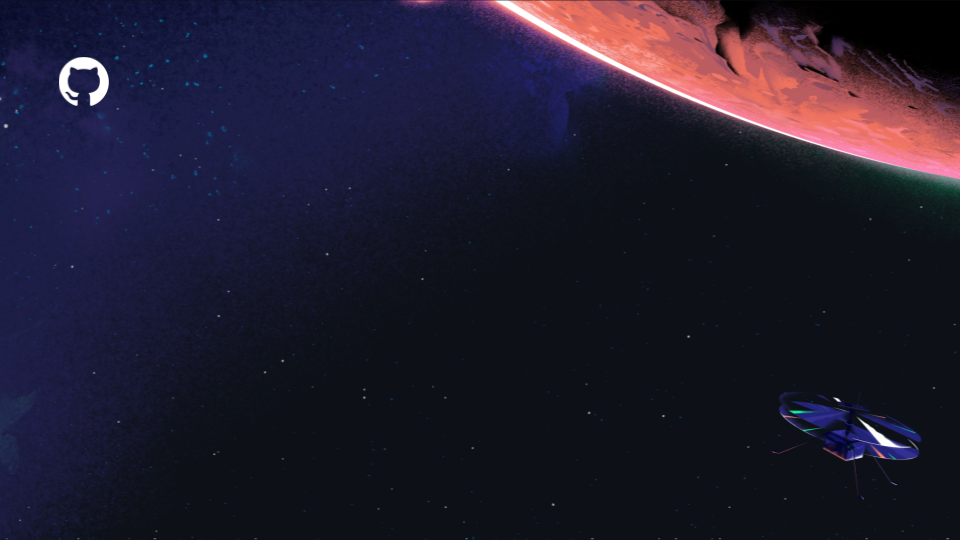

<!-- hide footer in marp -->
<!-- _footer: "" -->

# Actions Runner Controller Demo

<!--  -->

 @gitstua

---
<!-- hide footer in marp -->
<!-- _footer: "" -->

  

  # AGENDA
  

  

- What is ARC?
- ARC as part of Actions in the demo of the long text line running over
- Demo - deploying ARC
- Runner groups

  

---

# Example of new-list div wrapping h1 h2 

## testing123
- world hello world hello world hello world hello world hello world hello world h- hello
- world

## H2
- a 
- d
- s

---

  

  # What is ARC?
  

  

  - the dog and the cat
  - b 
  - c
  - actions ghas runners repos and options
  - actions runner controller

  

---

# ARC as part of Actions
<!-- 

 -->

- a
- b
- c

---

# Demo - deploying ARC
<!-- 
- Open codespace
- show scaleset controller deployment
- show scaleset
 -->

---

# Runner groups

---

## Recap - Actions runners can be:

- Standard GitHub runners
- Larger GitHub hosted runners
- Running on a VM
- Running in Docker
- Running in Kubernetes

---

## Recap 2 - Actions Runner Controller
- A community project adopted under GitHub.com/actions/
- Elastic - a way to have runners which are created when jobs need them
- Run on your own hardware or in a cloud provider

## Resources
Some helpful resources are located at [gh.io/ARC-Resources](https://gh.io/ARC-Resources)
