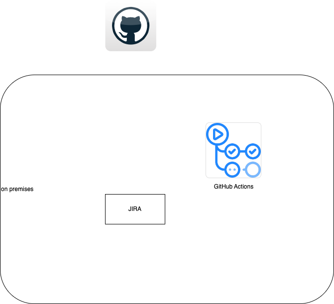

## Example of fancy list with circular icons

- aaa
- bbb

---

# Contoso
## Customer Success Business Review

 Stuart Eggerton

 Jacola

---
# Architecture

- GHEC EMU
- On premises
  - JIRA
  - GitHub Actions Runners

---
<!-- This next line removes the invert so we match the background of the image we are using -->
<!-- 
class: none 
footer: ""
-->

# Awesome objective 1

## Progress
 
- test
- test

## Next

---
<!-- class: invert -->
# Using this slide deck template 
1. Ensure you have the vscode plugins installed 
  - https://marketplace.visualstudio.com/items?itemName=marp-team.marp-vscode
  - https://marketplace.visualstudio.com/items?itemName=hediet.vscode-drawio
1. 

---
